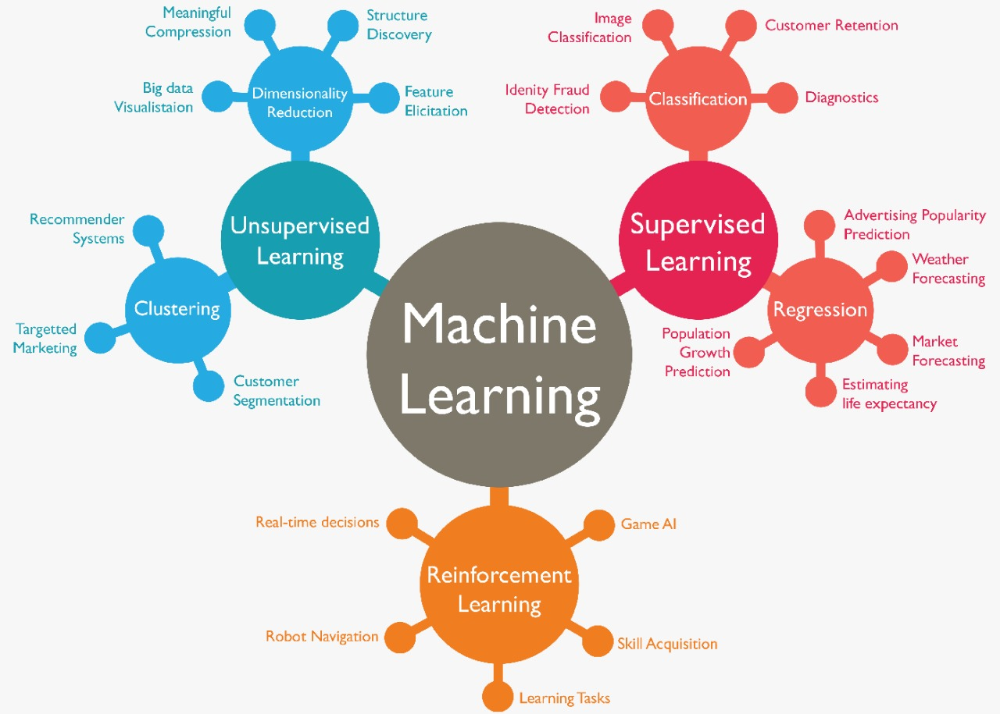

# 100-Days-of-ML-Code-Challenge  

### Day 1 | Intro to Machine Learning

* What is Machine Learning?
* Types of Machine Learning. 
* Application of Machine Learning.

### Day 2 | Essential Mathematics for Machine Learning

* Linear Algebra.
* Matrix and vector operations.
* Eigen Value, Eigen vector & Eigen decomposition.
* Linear independent and Linear dependent.
* Linear system of equation, Gauss Elimination.
* Calculus

### Day 3 | Probability and Statistics

* Measures of central tendencies
* Descriptive and Inferential Statistics
* Types of Data
* Distributions
* Normal distribution
* Z distribution

### Day 4 | Probability continuation

* Central Limit Theorem
* Estimators
* Confidence Intervals
* T-distribution
* Hypothesis testing

### Day 5 | Trained our first model from Kaggle 

* How Model works
* Basic Model Exploration
* Your first machine learning
* Model Validation
* Underfitting and Overfitting
* Random Forests
* Machine Learning Competition

Link to Resource [here](https://www.kaggle.com/learn/intro-to-machine-learning)   |    Link to our code [here](https://github.com/ashu-ashish/100-Days-of-ML-Code-Challenge/tree/main/Code/1_Intro%20to%20machine%20Learning%20from%20kaggle)   |   Link to Certificate[here](https://www.kaggle.com/learn/certification/ashuashish/intro-to-machine-learning)
  

### Day 6-8 | Intermediate Machine Learning from kaggle

* Dealing with Missing Values
* Categorical Variables
* Pipeline
* Cross-Validation
* pipeline
* introduction to XGBoost
* Data Leakage

Link to our resource [here](https://www.kaggle.com/learn/intermediate-machine-learning)     |   Link to our code [here](https://github.com/ashu-ashish/100-Days-of-ML-Code-Challenge/tree/main/Code/2_Intermediate%20Machine%20Learning)    |   Link to certificate[here](https://www.kaggle.com/learn/certification/ashuashish/intermediate-machine-learning)

### Day 9-10 | Pandas from Kaggle

* Creating, Reading and Writing
* Indexing, Selecting & Assigning
* Summary Functions and Maps
* Grouping and Sorting
* Data Types and Missing Values
* Renaming and Combining

Link to our resource [here](https://www.kaggle.com/learn/pandas)     |   Link to our code [here](https://github.com/ashu-ashish/100-Days-of-ML-Code-Challenge/tree/main/Code/3_Pandas)    |   Link to certificate[here](https://www.kaggle.com/learn/certification/ashuashish/pandas)

### Day 11 | Data Cleaning from Kaggle

* Handling Missing Values
* Scaling and Normalization
* Parsing Dates
* Character Encodings
* Inconsistent Data Entry

Link to our resource [here](https://www.kaggle.com/learn/data-cleaning)     |   Link to our code [here](https://github.com/ashu-ashish/100-Days-of-ML-Code-Challenge/tree/main/Code/4_Data%20Cleaning)    |   Link to certificate[here](https://www.kaggle.com/learn/certification/ashuashish/data-cleaning)

### Day 12-15 | Data Analysis with Python from cognitiveclass.ai

  * #### Introduction
     * Introduction to Data Analysis with Python 
     * The Problem 
     * Understanding the Data 
     * Python Packages for Data Science 
     * Importing and Exporting Data in Python 
     * Getting Started Analyzing Data in Python 

   * #### Data Wrangling
     * Pre-processing Data in Python 
     * Dealing with Missing Values in Python 
     * Data Formatting in Python 
     * Data Normalization in Python 
     * Binning in Python 
     * Turning categorical into quantitative variables 

   * #### Exploratory Data Analysis
     * Exploratory Data Analysis 
     * Descriptive Statistics 
     * GroupBy in Python 
     * Analysis of Variance (ANOVA) 
     * Correlation 
     * Correlation Statistics 

   * #### Model Development
     * Introduction
     * Simple and Multiple Linear Regression 
     * Model Evaluation using Visualization 
     * Polynomial Regression and Pipelines 
     * Measures for In-Sample Evaluation 
     * Prediction and Decision Making 

   * #### Model Evaluation:
     * Model Evaluation and Refinement 
     * Model Evaluation 
     * Overfitting, Underfitting and Model Selection 
     * Ridge Regression
     * Grid Search.

### Day 16-17 | Data Visualization from Kaggle

* Hello, Seaborn
* Line Charts
* Bar Charts and Heatmaps
* Scatter Plots
* Distributions
* Choosing Plot Types and Custom Styles
* Final Project

Link to our resource [here](https://www.kaggle.com/learn/data-visualization)    |   Link to our code [here]()  |   Link to certificate[here]()

### Day 18-21 | Data Visualization with Python from cognitiveclass.ai

* #### Introduction to Visualization Tools

  * Introduction to Data Visualization
  * Introduction to Matplotlib 
  * Basic Plotting with Matplotlib 
  * Dataset on Immigration to Canada
  * Line Plots 

* #### Basic Visualization Tools
 
  * Area Plots 
  * Histograms 
  * Bar Charts 

* #### Specialized Visualization Tools
  * Pie Charts 
  * Box Plots 
  * Scatter Plots 

* #### Advanced Visualization Tools

  * Waffle Charts 
  * Word Clouds 
  * Seaborn and Regression Plots 

* #### Creating Maps and Visualizing Geospatial Data
 
  * Introduction to Folium 
  * Maps with Markers  
  * Choropleth Maps 
  
### Day 21-23 | Exploratory Data Analysis
  * Titanic Dataset
  * Terrorism Datset

### Day 24-30 | Machine Learning from cognitiveclass.ai

  * #### Module 1 - Machine Learning

    * Intro to Machine Learning 
    * Python for Machine Learning 
    * Supervised vs Unsupervised 
        
  * #### Module 2 - Regression

    * Intro to Regression 
    * Simple Linear Regression 
    * Multiple Linear Regression 
    * Model Evaluation 
    * Evaluation Metrics 
    * Non-Linear Regression 
    
    Exercise link [here]
    
    
 * #### Module 3 - Classification

    * Intro to Classification
    * K-Nearest Neighbors
    * Evaluation Metrics

    * Intro to Decision Trees 
    * Building Decision Trees 

    * Intro to Logistic Regression 
    * Logistic vs Linear Regression 
    * Support Vector Machine 

    
